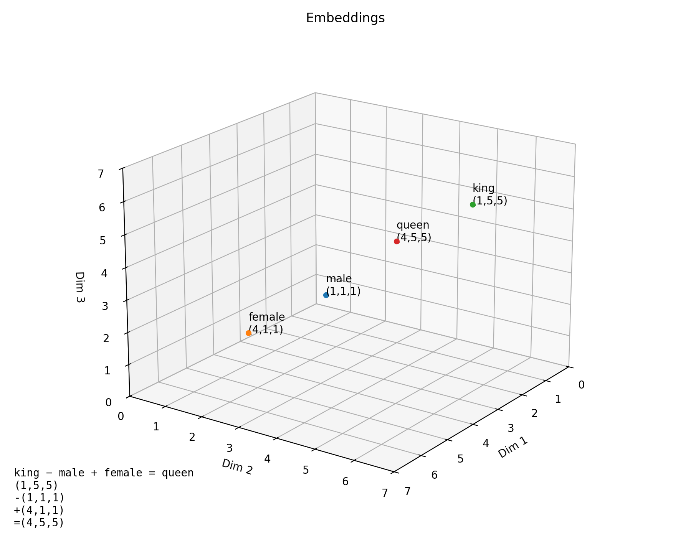

# MCDA5511 - Assignment1 - Sentence Embeddings

This visualization shows the similarity between classmates based on their stated written interests.  
Each point represents a student, and the distance between points reflects how similar their interests are. These positions are based on sentence embeddings generated using the all-MiniLM-L6-v2 model and then reduced to two dimensions using UMAP for visualization.

Students with similar interests appear closer together, while those with different interests appear farther apart.

## Generated Visualization


## How to run this project

```bash
uv sync
uv run python main.py
```

## What Are Embeddings?

Mathematical models need numbers to perform calculations, not letters or words. Because of this, words and sentences must be transformed into numerical representations so that algorithms can process them and perform tasks such as clustering, classification, or similarity detection. 

These numerical representations are called embeddings. However, these numbers cannot simply be random. They must preserve meaning so that the relationships between words and sentences are reflected accurately. Embeddings are generated by deep learning models that learn patterns from large amounts of text and assign numbers in a meaningful way. These models learn which words and sentences tend to appear in similar contexts and use that information to create representations that capture meaning.  

A well-known example of word embeddings illustrates how meaning can be preserved through numerical relationships. If we take the embedding for the word “king”, subtract the embedding for “male”, and then add the embedding for “female”, the result is numerically close to the embedding for “queen”. This shows that embeddings capture relationships such as gender and roles, not just the spelling of words. In this way, embeddings allow mathematical models to reason about language in a way that reflects real-world meaning and associations.  

Sentence embeddings work in a similar way but operate on entire sentences rather than individual words. Instead of representing a single word, the model analyzes the overall meaning of a sentence and assigns a numerical representation that reflects its themes and context. For example, a student who writes “I enjoy gaming and playing cricket and volleyball” may be placed near someone who mentions sports or other recreational activities, even if they use different wording. Likewise, someone who says “I like to watch movies, reading detective novels and listening music” might appear close to another student who enjoys reading books, hiking, and watching documentaries because both descriptions reflect leisure activities such as reading and entertainment. Even though the exact words differ, the underlying interests are similar, and embeddings capture that similarity. By converting language into meaningful numerical form, embeddings make it possible for algorithms to compare, group, and visualize text based on meaning rather than exact wording. This allows models to identify patterns and relationships across large collections of text. 

The following figure illustrates a simple three-dimensional example of embeddings. In this illustrative representation, one dimension can be interpreted as a royalty-related attribute, another as a gender-related attribute, and the third as an additional contextual dimension. The embeddings (coordinates) shown are illustrative and were created for explanatory purposes to help visualize how embeddings can represent semantic relationships and analogies, such as how the relationship between king and queen reflects the relationship between male and female.



## Embedding Sensitivity Tests

To test how sensitive the matchmaking results are to the choice of AI model, I compared the original model (`all-MiniLM-L6-v2`) with a larger, more complex model (`all-mpnet-base-v2`).

**Quantitative Results**
I calculated the Spearman Rank Correlation between the rankings produced by the two models for my own profile ("Nikola Kriznar").
* **Spearman's Rank Correlation:** 0.3873

This score is surprisingly low (on a scale of 0 to 1), indicating that the choice of model significantly changes which classmates are considered similar to me. The results are highly sensitive to model selection.

**Qualitative Analysis**
While the results changed significantly, the #1 match remained stable across both models:
* **Model A (MiniLM) Top 3:** Zilong Wang, Binziya Siddik, Bhavik Kantilal Bhagat
* **Model B (MPNet) Top 3:** Zilong Wang, Somto Muotoe, Mohammad Pakdoust

The shift in the 2nd and 3rd spots reveals that the models prioritize different semantic features.
1.  **Zilong Wang** remained #1 in both, likely due to the shared keyword "sports" (My profile: "sports/gym", His: "likes sports").
2.  **Model A** prioritized "Music," matching me with classmates who explicitly listed music as a hobby (Binziya and Bhavik).
3.  **Model B** (the more advanced model) successfully identified the semantic link between my interest in "competitive gaming" and classmates who listed "video games" (Somto and Mohammad).

This suggests that the larger MPNet model was better able to capture the semantic relationship between "gaming" and "video games," whereas the smaller MiniLM model relied more heavily on direct keyword overlaps like "music" and "sports."

