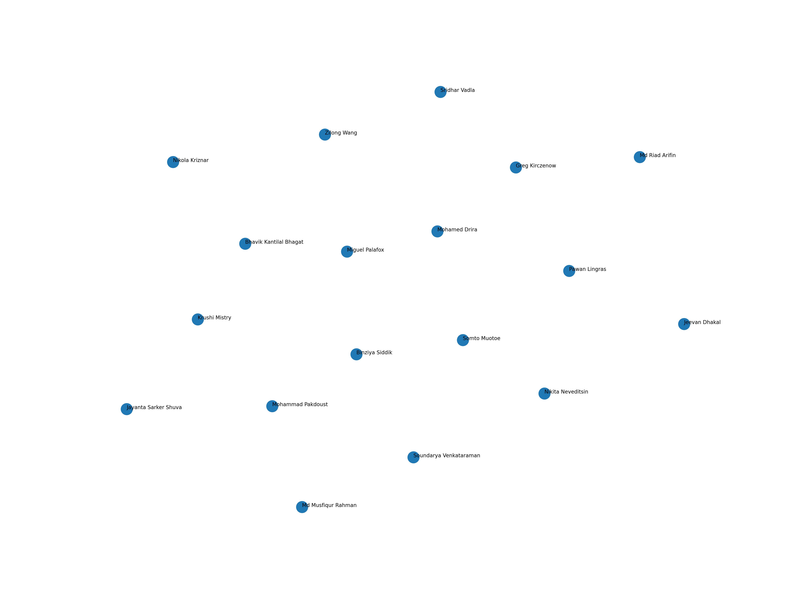

# MCDA5511 - Assignment1 - Sentence Embeddings

This visualization shows the similarity between classmates based on their stated written interests.  
Each point represents a student, and the distance between points reflects how similar their interests are, using sentence embeddings generated with the all-MiniLM-L6-v2 model and reduced to two dimensions using UMAP.

Students with similar interests appear closer together, while those with different interests appear farther apart.

## Generated Visualization



## How to run this project

```bash
uv sync
uv run python visualizer.ipynb
```


